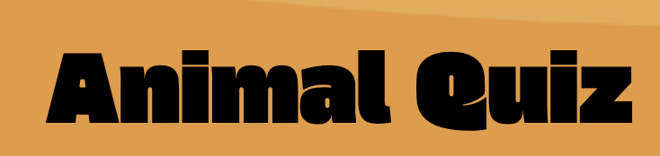

)

# Summary
Animal quiz is a trivia multiple choice question quiz, which is designed to test users animal knowledge. The quiz features four choices of questions, which highlights green or red to indication correct or incorrect knowledge, and finally presenting a score at the end. 
The website is brightly styled, features a consistent theme and clear for users to read and understand.
 

# Wireframes

 Prior to coding the game, I used Cacoo and Balsamic to create wireframes to get an idea of how I want create a realistic and achievable design. The idea is to give me a basic visual structure before I write the markup, and style the CSS.

 Below you will find a colour and text style scheme, a webpage layout of the quiz (please note I wrote 'questions' where the 'answers' would be in error), the score pop-up message, and a mobile view which is similar to the desktop views, using media queries I am able to downsize it. 
 

<table>
<tr>
<td></td>
<td></td>
</tr>
<tr>
<td></td>
<td></td>
</tr>
</table>

# Features

<table>
<tr>
<td></td>
<ul>
<li>The index page consists of a consistent use of beige, green and white colours.</li>
<li>The logo also acts as a link to the homepage, and beside it to the right is a navigation bar that links to three pages, when hovered over the links on a desktop or laptop the text changes colour to grey.</li>
<li>Hero image is placed in the center which zooms in when users open the webpage. A slogan is seen at the bottom left on larger screens.
<li>Two YouTube videos are placed on the homepage which adds more functionality and content to the  homepage. 
<li> A footer is consistently shown on every page with a similar colour scheme, linking it to four social media accounts. The copyright is intentionally placed for up to 430px as it did not look good on smaller screens.</li>
</ul>
</tr>
</table>

<table>
<tr>
<td><td></td>
<ul>
<li>The projects page features a gallery of nine photographs of various interior design styles from bedroom to home office designs.</li> 
<li>On larger screens there is a hover feature, where the background blurs and a text detailing the imagery appears.</li>
<li>Using flexbox, the images were able to appear to be more inline and centered, also sizing down evenly as the size of the screen reduces.</li>
</ul>
</tr>
</table>

<table>
<tr>
<td></td>
<td></td>
<ul>
<li> The services pages is where users can find an overview of the companies services listed in an organised fashion, with clear and concise wording so that anyone who is not a professional designer can understand.</li>
<li>As drawn out in the wireframe, for larger screens the design consists of two images in each row with a text box in the middle.</li>
<li> For mobile view, the best way to achieve a cleaner aesthetic was to hide every second photo. The result as shown is one image per text box which is stacked on top of each other.</li>
</ul>
</tr>
</table>

<table>
<tr>
<td></td>
<td></td>
<td></td>
<ul>
<li> The contacts page is designed for users to leave their name, email, phone number, and reason for contact to hear back from the company. Using form validation, the user will receive a notification if any required fields have not been entered.</li>
<li>A text box below the form features three key contact information such as a number, address and email address with accompanied fontawesome icons for users that prefer to contact the company another way. Under this is an embedded map which makes this page more interactive and engaging</li>
<li> As shown in the screenshots on the far right, the mobile view has hidden the input field for user surname and mobile number to keep it short.</li>
<li>When the screen size is reduced to an iPad and mobile view, users will find a burger toggle button on the top right corner beside the logo. This drops down a menu with the three other pages, when clicked, the link displays an underline before opening the new page.</li>
</ul>
</tr>
</table>

## Features for the future 

# Technologies used
Languages used: 

<ul>
<li>HTML
<lI>CSS
<li>JavaScript

Libraries, websites and frameworks:

<Li>Fontawesome</Li> 
All of the icons for the footer and contacts page were taken from Fontawesome.
<Li>Github</li>  
Used frequently to commit, and push codes.
<Li>Google Fonts</li>   
Used to style header and innerHTML throughout the website.
<li>Cacoo and Balsamic</li> 
Used to create wireframes before coding in to have a visual examples.
<li>Stackoverflow</li>
I searched for existing minor issues that were already posted on Stackoverflow by members to help inspire quick solutions to any issues I was having with my code.
<li>[Vecteezy](https://www.vecteezy.com/vector-art/)<li>
For the background image, I used this website.
<li>[responsivetesttool](https://responsivetesttool.com/)<li>
Used to test website on multiple and most common screens 
<li>YouTube</li>
I've searched for tutorials and added this above relevant code

# Testing

## Browsers and Screen sizes
- I've confirmed that this project looks good on different browsers such as Chrome, Firefox, and Safari. 
- I've confirmed that the pages are all responsive, and look good multiple large screen sizes especially starting from 1700px to the smallest being 360px. 
- I've gone through majority of the screens on devtools, and even further on [responsivetesttool](https://responsivetesttool.com/).
- I've confirmed text, especially for questions and answers is readable, and the colour scheme does not clash or cause any issues to the user's ability to smoothly navigate around the page.
- I've confirmed that the website is easy to navigate for a user and accurately displays a score at the end of the quiz, and responds quickly indicating the right or wrong answer. The quiz also offers to start again at the end which inturn reshuffles the questions.
  
## Bugs encountered 
  
- There were quotation marks around questions, I fixed this by changing the ‘textcontent’ to ‘innerHTML’. 
- Fetching API, several attempts to get it right. Took pieces of code from websites provided to get it to work. 
- There was one day worth of delay due to network breakdowns, and could not do anything about it. 
- Once my website was deployed to GitHub, the game area had dissappeared. The way I got it to work was to remove “/“ from the script file in HTML.
- I tried 4 different tutorials from Youtube to get click sounds to work, and tried writing the code myself with no avail before copying the code from the link provided in code library section.  
- The code I input for the click sound effects was not working for all the buttons, it only worked for the next button. Thanks to the Tutor Sean who helped me learn that this was a timing issue, that I needed to add an event listener AFTER the buttons have been generated on the page. It worked once that code was placed in a function and called it after the cards are generated.
- To hide the ‘next question’ button once the score message pops up, I found a code online which I have added the link too. The code suggested to write [functionname].style.visibility = ‘hidden’;. I fixed this by changing the code to .style.display = 'none'; which I’ve used before, but in CSS.

## Bugs left unfixed

## Validation 

- I've confirmed that no errors were flagged when passing all pages of my HTML code by direct input through the [official W3C Validator]()
- I've confirmed that no errors were flagged when passing my CSS code by direct input through the [official Jigsaw Validator]()
- I've confirmed that no errors were flagged when passing my JavaScript code by direct input through the [JShint]()
- I've run the lighthouse tool via devtools to test the performance of the website with good results.
   

  

# Credits

# Deployment
To deploy my webpage, I took the following steps:
1. head to the web page's repository, and select 'settings'
2. from settings, select 'pages' on the left-hand corner
3. Under Source select 'deploy from branch'
4. Under Branch select the publishing source, in my case I've selected 'main' and '/(root)', then click save
5. After a few seconds, and refreshing the webpage, I was able to see a link to my website on the top of the webpage.
6. Using git commit and git push to send my changes to GitHub I was able to see any changes made to the website.

### Deploying the ReadME.md
1. Commit the file, git add README.md 
2. git commit -m "added README.md"
3. git push 
   
The site was deployed to github and can be found here: https://sabbahs.github.io/beautiful-interiors/