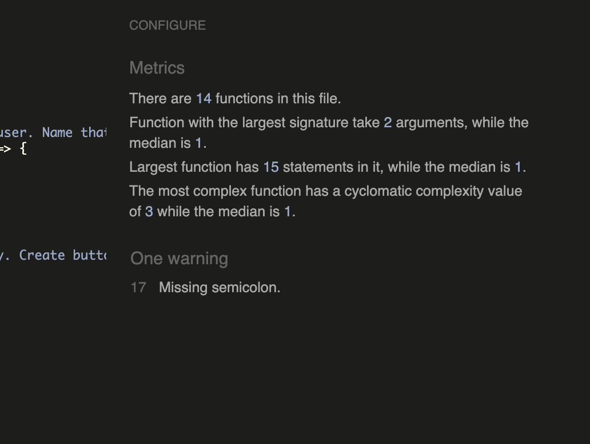

)

# Summary
Animal quiz is a trivia multiple choice question quiz, which is designed to test users animal knowledge. The quiz features four choices of questions, which highlights green or red to indication correct or incorrect knowledge, and finally presenting a score at the end. 
The website is brightly styled, features a consistent theme and clear for users to read and understand.
 

# Wireframes

 Prior to coding the game, I used Cacoo and Balsamic to create wireframes to get an idea of how I want create a realistic and achievable design. The idea is to give me a basic visual structure before I write the markup, and style the CSS.

 Below you will find a colour and text style scheme featuring white, black and orange, a webpage layout of the quiz (please note I wrote 'questions' where the 'answers' would be in error), the score pop-up message, and a mobile view which is similar to the desktop views, using media queries I am able to downsize it. 
 

<table>
<tr>
<td></td>
<td></td>
</tr>
<tr>
<td></td>
<td></td>
</tr>
</table>

# Features

<table>
<tr>
<td></td>
<td><td></td>
<ul>
<li>The quiz features a logo, a section for questions, four buttons with options of answers for using to select from, and a next question button. 
<li>As shown, once the selection is chosen, the user will immediately be able to see weather their answer is correct (highlighted in green) or incorrect (highlighted in red).
<li>Once a answer selection is made, the other options will be disabled, which stops the user from deselecting and selecting. 
<li>Throughout the page the buttons display a clicking sound. 
<li>Once the user has answered the question, there is a 'Next Question' button, this will return another set of questions, and answers.
<li>Code has been appropriately added to ensure that the quiz randomly displays correct and incorrect answers, as initially all the correct answers where displaying at the bottom. 
</ul>
</tr>
</table>

<table>
<tr>
<td></td>
<td></td>
<ul>
<li>Media queries have been placed to ensure that the quiz looks size appropriate in smaller screen sizes, and that the question and answer text are clearly readable by the user.
<li>Whilst the background image features silhouette of animals, I've decided to keep the image zoomed in as the images looked a bit distracting and too busy, the orange tones looked nice as it is, and complimented the theme of the webpage. 
</tr>
</table>

<table>
<tr>
<td></td>
<td></td>
<ul>
<li> Once the user has gotten through all 10 questions, the 'Next button' will disappear and reveal a black box with orange text letting the user know that they've completed the quiz, and display the number of correct answers they've scored. 
<li>Within the black box, users will have the option to click the 'Play Again' button which will restart the quiz, and shuffle the questions and answers.
</ul>
</tr>
</table>

# Technologies used
Languages used: 

<ul>
<li>HTML
<lI>CSS
<li>JavaScript

Libraries, websites and frameworks:

<Li>Fontawesome</Li> 
All of the icons for the footer and contacts page were taken from Fontawesome.
<Li>Github</li>  
Used frequently to commit, and push codes.
<Li>Google Fonts</li>   
Used to style header and innerHTML throughout the website.
<li>Cacoo and Balsamic</li> 
Used to create wireframes before coding in to have a visual examples.
<li>Stackoverflow</li>
I searched for existing minor issues that were already posted on Stackoverflow by members to help inspire quick solutions to any issues I was having with my code.
<li>[Vecteezy](https://www.vecteezy.com/vector-art/)<li>
For the background image, I used this website.
<li>[responsivetesttool](https://responsivetesttool.com/)<li>
Used to test website on multiple and most common screens 
<li>YouTube</li>
I've searched for tutorials and added this above relevant code

# Testing

## Browsers and Screen sizes
- I've confirmed that this project looks good on different browsers such as Chrome, Firefox, and Safari. 
- I've confirmed that the pages are all responsive, and look good multiple large screen sizes especially starting from 1700px to the smallest being 360px. 
- I've gone through majority of the screens on devtools, and even further on [responsivetesttool](https://responsivetesttool.com/).
- I've confirmed text, especially for questions and answers is readable, and the colour scheme does not clash or cause any issues to the user's ability to smoothly navigate around the page.
- I've confirmed that the website is easy to navigate for a user and accurately displays a score at the end of the quiz, and responds quickly indicating the right or wrong answer. The quiz also offers to start again at the end which inturn reshuffles the questions.
  
## Bugs encountered 
  
- There were quotation marks around questions, I fixed this by changing the ‘textcontent’ to ‘innerHTML’. 
- Fetching API, several attempts to get it right. Took pieces of code from websites provided to get it to work. 
- There was one day worth of delay due to network breakdowns, and could not do anything about it. 
- Once my website was deployed to GitHub, the game area had dissappeared. The way I got it to work was to remove “/“ from the script file in HTML.
- I tried 4 different tutorials from Youtube to get click sounds to work, and tried writing the code myself with no avail before copying the code from the link provided in code library section.  
- The code I input for the click sound effects was not working for all the buttons, it only worked for the next button. Thanks to the Tutor Sean who helped me learn that this was a timing issue, that I needed to add an event listener AFTER the buttons have been generated on the page. It worked once that code was placed in a function and called it after the cards are generated.
- To hide the ‘next question’ button once the score message pops up, I found a code online which I have added the link too. The code suggested to write [functionname].style.visibility = ‘hidden’;. I fixed this by changing the code to .style.display = 'none'; which I’ve used before, but in CSS.

## Bugs left unfixed

I cannot see any bugs unfixed.

## Validation 

- I've confirmed that no errors were flagged when passing all pages of my HTML code by direct input through the [official W3C Validator]()
- I've confirmed that no errors were flagged when passing my CSS code by direct input through the [official Jigsaw Validator]()
- I've confirmed that no errors were flagged when passing my JavaScript code by direct input through the [JShint]()
- I've run the lighthouse tool via devtools to test the performance of the website with good results.
   

  

# Credits
Trivia API, provided by Mentor: https://opentdb.com/api_config.php
How to fetch API data, link provided by Mentor:: https://reqbin.com/code/javascript/wc3qbk0b/javascript-fetch-json-example 
E.target explanation: https://www.altcademy.com/blog/what-is-e-target-in-javascript/#:~:text=In%20JavaScript%2C%20e%20typically%20stands,click%20or%20a%20keystroke%2C%20happened
Mouse click: https://www.fesliyanstudios.com/royalty-free-sound-effects-download/mouse-click-2
Mouse click how to: https://dev.to/shantanu_jana/how-to-play-sound-on-button-click-in-javascript-3m48
Restart button: https://teamtreehouse.com/community/any-one-know-how-to-make-a-restart-button 
JS formatter: https://beautifier.io/
Code inspired from here but not copied: https://stackoverflow.com/questions/8685107/hiding-a-button-in-javascript

# Deployment
To deploy my webpage, I took the following steps:
1) head to the web page's repository, and select 'settings'
2) from settings, select 'pages' on the left-hand corner
3) Under Source select 'deploy from branch'
4) Under Branch select the publishing source, in my case I've selected 'main' and '/(root)', then click save
5) After a few seconds, and refreshing the webpage, I was able to see a link to my website on the top of the webpage.
6) Using git commit and git push to send my changes to GitHub I was able to see any changes made to the website.

### Deploying the ReadME.md
1) Commit the file, git add README.md 
2) git commit -m "added README.md"
3) git push 
   
The site was deployed to github and can be found here: https://sabbahs.github.io/beautiful-interiors/